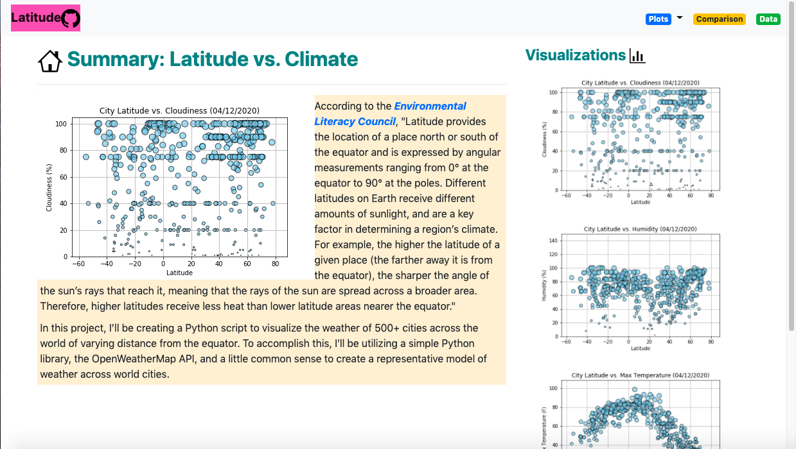

# 11-HTML-WebDesign

### The deployed website:
* https://maia1220.github.io/index.html

### Goal

Creating a visualization dashboard website using visualizations from another project. Specifically, I plotted [weather data](weather_city_data.csv).

In building this dashboard, I created individual pages for each plot and a means by which you can navigate between them. These pages will contain the visualizations and their corresponding explanations. I also have a landing page, a page where you can see a comparison of all of the plots, and another page where you can view the data used to build them.

### Website Requirements

The website must consist of 7 pages total, including:

* A landing-page containing:
  * An explanation of the project.
  * Links to each visualizations page.
* Four visualization-pages, each with:
  * A descriptive title and heading tag.
  * The plot/visualization itself for the selected comparison.
  * A paragraph describing the plot and its significance.
* A comparisons-page that:
  * Contains all of the visualizations on the same page so we can easily visually compare them.
  * Uses a bootstrap grid for the visualizations.
    * The grid must be two visualizations across on screens medium and larger, and 1 across on extra-small and small screens.
* A data-page that:
  * Displays a responsive table containing the data used in the visualizations.
    * The table must be a bootstrap table component. [Hint](https://getbootstrap.com/docs/4.3/content/tables/#responsive-tables)
    * The data come from exporting the `.csv` file as HTML, or converting it to HTML.